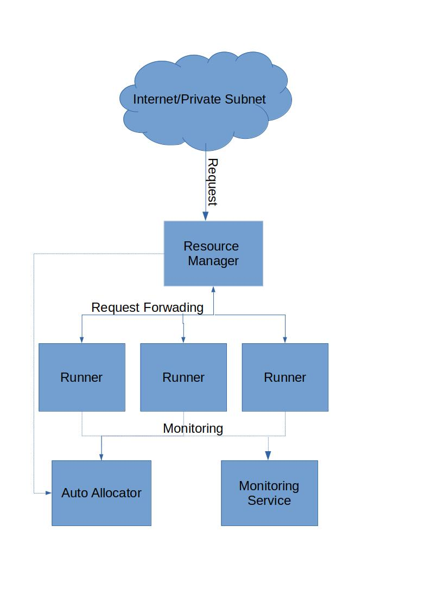

# Lock Free Grid Engine
This is a lock free version of grid engine written in C++ with help of actor pattern library C++ Actor Framework. The main objective of this library is to make a grid engine which is out performs other grid engine, lock free to avoid any deadlocks and event driven. I am looking forward to use google protocol buffer to send syncronisation, monitoring and calculation messages. Currently this library is under development. I am looking forward to implement following architecture.

### **Runner**
Runner is a computational component in the architecture. It will do the treatement of the given message.

### **Resource Manager**
Resource Manager does load balancing between different runners. Normally a runner will register itself to the Resource Manager with which types of message will be treated. Resource Manager will also split a task into different tasks, send them to different runners and aggregate the results.

### **Auto Allocator**
Auto Allocator monitors different processes and machine. It looks at the load in the system and allocates the required resources

### **Monitoring system**
Monitoring System monitors all the different components and aggregates the logs

